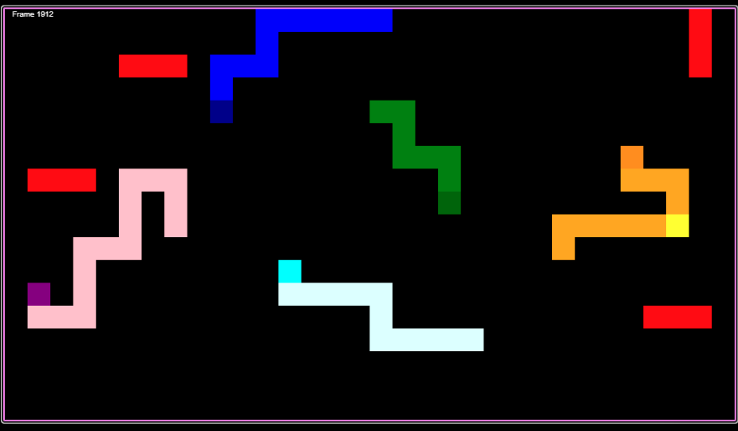

# wep--SnakeGameApp

__Projet:__

    -Le but de ce projet d’intégration est de développer une application web se basant sur
    node js pour jouer un jeu de snake en multiplayers.
    
    L'application se base sur javascript, html, css and json
    
    L'exécution du programme requiert l'installations des modules nodejs dont express, express_ws
    reload via npm
